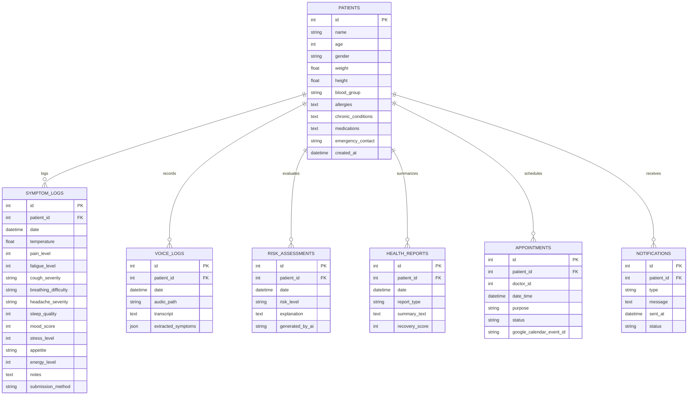

# AI Health Tracker

AI Health Tracker is a FastAPI application for continuous patient symptom monitoring and clinician oversight. Patients can submit daily vitals and symptom logs via a web UI or voice recordings; voice logs are transcribed and parsed into structured health metrics by a generative AI model. The backend stores data in SQLite using SQLAlchemy, exposes clear REST endpoints, and powers a Doctor Dashboard with automated risk assessments and patient reports. The frontend uses simple HTML/CSS/JavaScript and the development server can be exposed with ngrok for remote testing.

Repository: https://github.com/JestuAshok/AI-Health-Tracker
Author: JestuAshok

---

## Scenarios

### Scenario 1: Daily Symptom Logging and Progression Analysis
A patient logs their daily symptoms (temperature, pain level, sleep quality, etc.) via the web form. The backend automatically queries their previous log, performs a comparative analysis of their metrics (e.g. temperature changes, fatigue trends), calculates improvements or worsenings, and returns an immediate overall progress message (e.g., "Overall, your health is better compared to yesterday!") alongside granular details.

### Scenario 2: Voice-Enabled Symptom Tracking via AI
A patient feeling unwell accesses the Voice Logger page and dictates: *"I've been feeling extremely tired today, my head is throbbing with a pain of about 7, and I think I have a slight fever of 100.5 degrees."* The transcript is sent to the FastAPI backend, where Groq's LLaMA 3.3 model extracts structured JSON data (`temperature: 100.5`, `fatigue_level: 8`, `pain_level: 7`) and provides an empathetic voice-log summary before saving the log directly into the SQLite database.

### Scenario 3: Doctor Monitoring & Risk Assessment
A clinician logs into the Doctor Dashboard, accessing a high-level view of all registered patients, their recovery scores, and AI-generated risk levels. The doctor can click on any patient to examine detailed symptom history charts, view daily health reports, review automated risk assessments, and schedule follow-up appointments synced with calendar events.

---

## Technical Architecture

### Description
AI Health Tracker utilizes a modular three-tier architecture to deliver rapid, AI-driven healthcare monitoring:
- **Frontend**: Responsive single-page and dashboard layouts built with HTML5, vanilla CSS (implementing a modern glassmorphism design system), and JavaScript (Fetch API for asynchronous data operations).
- **Backend**: FastAPI web framework running on Uvicorn, organizing modular router endpoints (`patients`, `symptoms`, `voice`, `analytics`, `appointments`).
- **Database Layer**: SQLite database managed via SQLAlchemy ORM, representing models for patients, symptom logs, voice transcripts, risk levels, and health summaries.
- **AI Integration**: Groq API using the `llama-3.3-70b-versatile` model to extract structured data from voice inputs.
- **Tunnelling/Deployment**: Integrated `pyngrok` connection which starts automatically on app startup, exposing the local FastAPI server over a secure public URL.

### Entity Relationship (ER) Diagram


---

## Pre-requisites
- **FastAPI Web Framework**: [FastAPI Documentation](https://fastapi.tiangolo.com/)
- **SQLAlchemy ORM**: [SQLAlchemy Documentation](https://www.sqlalchemy.org/)
- **Groq API Cloud Platform**: [Groq API Documentation](https://console.groq.com/docs)
- **HTML, CSS, and JavaScript Skills**: [W3Schools HTML/CSS/JavaScript Tutorials](https://www.w3schools.com/)
- **Python Programming Proficiency**: [Python Documentation](https://docs.python.org/3/)
- **Version Control with Git**: [Git Documentation](https://git-scm.com/doc)
- **Development Environment Setup**: [FastAPI Installation Guide](https://fastapi.tiangolo.com/deployment/)
- **Ngrok for Public Tunneling**: [Ngrok Documentation](https://ngrok.com/docs)

---

## Project Workflow

### Milestone 1: Model Selection and Architecture
- **Activity 1.1**: Generate a Groq API key and configure it securely in the backend environment.
- **Activity 1.2**: Research and select the appropriate generative AI model from Groq for medical transcript text processing.
- **Activity 1.3**: Define the database schema (SQLite) and draft the application's ER diagram showing clinical logs and records.
- **Activity 1.4**: Set up the development workspace, including Python venv creation, installing dependencies, and structuring backend directories.

### Milestone 2: Core Functionalities Development
- **Activity 2.1**: Implement core database actions: Patient registration, symptom logging, voice transcript extraction, and history aggregation.
- **Activity 2.2**: Develop FastAPI routes handling REST endpoints for dashboard requests.

### Milestone 3: Main Application Logic Development
- **Activity 3.1**: Write backend application bootstrap logic in `main.py` and implement routers under `app/api/routes/` with dependencies.

### Milestone 4: Frontend Development
- **Activity 4.1**: Design doctor/patient views using semantic HTML and custom glassmorphism styles (`css/styles.css`, `css/glassmorphism.css`).
- **Activity 4.2**: Build dynamic rendering systems in JavaScript to fetch endpoints and update DOM items asynchronously.

### Milestone 5: Deployment
- **Activity 5.1**: Test the application server locally using virtual environment triggers.
- **Activity 5.2**: Configure public ngrok deployment to launch tunnels programmatically on server startup.

### Milestone 6: Conclusion

---

## Milestone Details

### Milestone 1: Model Selection and Architecture
In this milestone, the focus is on selecting the appropriate generative AI model from Groq for medical symptom extraction. This involves researching the reasoning capabilities and speed of various models that Groq offers, ensuring the chosen model aligns with the goals of parsing unstructured text and extracting integers for pain/fatigue alongside temperature floats.

#### Activity 1.1: Generate a Groq API Key
1. **Create a Groq Account**: Visit https://console.groq.com and register.
2. **Navigate to API Keys**: Under the dashboard settings, select "API Keys".
3. **Create Key**: Click "Create API Key", provide a display name (e.g. `health-tracker-key`), and submit.
4. **Save Key**: Copy the generated API key and save it securely.
5. **Configure Configuration file**: The backend loads this variable in `backend/app/core/config.py`:
   ```python
   GROQ_API_KEY: str = os.getenv("GROQ_API_KEY", "your_copied_api_key_here")
   ```

#### Activity 1.2: Research and Select the Appropriate Generative AI Model
- **Understand Requirements**: Review the symptom voice log parser needs—requiring reasoning capabilities, structural JSON enforcement, and empathy.
- **Evaluate Models**: Groq offers LLaMA models. The `llama-3.3-70b-versatile` model is selected for its reasoning abilities, fast response times (due to Groq LPUs), and ability to output structured JSON format matching our schema with low temperature (0.0 to 0.2) to remain deterministic.

#### Activity 1.3: Define the Architecture of the Application
- **Draw Diagram**: Establish data flows between the HTML5/JS frontend, FastAPI backend, SQLite database (via SQLAlchemy), and the Groq API.
- **Outline Backend Flow**: FastAPI listens to routes, manages sessions via `get_db()`, communicates with Groq when voice inputs are received, updates SQLite rows, and updates dashboards.

#### Activity 1.4: Set Up the Development Environment
1. **Install Python & Pip**: Ensure Python 3.8+ is installed.
2. **Create Virtual Environment**:
   ```powershell
   python -m venv venv
   .\venv\Scripts\activate
   ```
3. **Install Requirements**:
   ```powershell
   pip install -r requirements.txt
   ```
4. **Create Directory Structure**:
   ```
   ai-health-tracker/
   ├── backend/
   │   ├── app/
   │   │   ├── api/
   │   │   │   └── routes/
   │   │   │       ├── analytics.py
   │   │   │       ├── appointments.py
   │   │   │       ├── patients.py
   │   │   │       ├── symptoms.py
   │   │   │       └── voice.py
   │   │   ├── core/
   │   │   │   ├── config.py
   │   │   │   ├── database.py
   │   │   │   └── ngrok.py
   │   │   ├── models/
   │   │   │   └── domain.py
   │   │   ├── schemas/
   │   │   │   └── domain.py
   │   │   └── main.py
   │   ├── generate_dummy_data.py
   │   ├── requirements.txt
   │   └── run.bat
   ├── frontend/
   │   ├── css/
   │   │   ├── glassmorphism.css
   │   │   └── styles.css
   │   ├── appointments.html
   │   ├── doctor-dashboard.html
   │   ├── health-reports.html
   │   ├── index.html
   │   ├── patient-dashboard.html
   │   ├── symptom-log.html
   │   └── voice-logger.html
   └── docker-compose.yml
   ```

---

### Milestone 2: Core Functionalities Development

#### Activity 2.1: Develop Core Content Generation Features
- **Symptom Tracker Form**: Patients fill out a detailed physical symptoms form, logging numerical values (1-10) and drop-down states (cough severity, breathing issues).
- **Voice Symptom Parser**: Processes unstructured audio/text summaries. It maps text to symptoms using a single structured prompt submitted to `llama-3.3-70b-versatile` with JSON output format forced:
  ```python
  prompt = f"""
  Analyze the following patient voice transcript and extract health symptoms.
  Respond ONLY with a valid JSON object in the following format. 
  Make sure to provide a unique, empathetic, and encouraging 'description' of what was detected, as if speaking to the patient.
  
  {{
      "temperature": (float, estimate based on transcript if mentioned like fever=101.5, default 98.6),
      "fatigue_level": (int 1-10, default 1),
      "pain_level": (int 1-10, default 1),
      "description": "A customized encouraging description based on their specific transcript."
  }}
  
  Transcript: "{text}"
  """
  ```

#### Activity 2.2: Implement the FastAPI Backend
- Inject db connection dependency to access and query tables.
- Process input validation using Pydantic Schemas (`SymptomLogCreate`, `PatientCreate`, etc.).
- Establish database models and auto-commit parameters.

---

### Milestone 3: app.py (main.py) Development

#### Activity 3.1: Writing the Main Application Logic in main.py and Routes
Configure routes, mount static HTML files, and run the tunnel.
- **FastAPI initialization (`app/main.py`)**:
  ```python
  from fastapi import FastAPI
  from fastapi.middleware.cors import CORSMiddleware
  from fastapi.staticfiles import StaticFiles
  from app.core.database import Base, engine
  from app.models import domain
  from app.api.routes import patients, symptoms, analytics, voice, appointments

  Base.metadata.create_all(bind=engine)

  app = FastAPI(
      title="AI Symptom Progression Tracker",
      description="Agentic AI-powered healthcare monitoring system",
      version="1.0.0"
  )

  app.add_middleware(
      CORSMiddleware,
      allow_origins=["*"],
      allow_credentials=True,
      allow_methods=["*"],
      allow_headers=["*"],
  )

  app.include_router(patients.router, prefix="/api", tags=["Patients"])
  app.include_router(symptoms.router, prefix="/api", tags=["Symptoms"])
  app.include_router(analytics.router, prefix="/api", tags=["Analytics"])
  app.include_router(voice.router, prefix="/api", tags=["Voice"])
  app.include_router(appointments.router, prefix="/api", tags=["Appointments"])

  # Mount static frontend
  import os
  frontend_path = os.path.abspath(os.path.join(os.path.dirname(__file__), "..", "..", "frontend"))
  app.mount("/", StaticFiles(directory=frontend_path, html=True), name="frontend")

  @app.on_event("startup")
  def startup_event():
      from app.core.ngrok import start_ngrok_tunnel
      start_ngrok_tunnel(port=8000)
  ```
- **Voice route (`app/api/routes/voice.py`)**:
  ```python
  @router.post("/voice-symptoms")
  def submit_voice_symptoms(request: VoiceSymptomRequest, db: Session = Depends(get_db)):
      # Read settings API key and create Groq client
      # Submit structured prompt to llama-3.3-70b-versatile
      # Extract json response and create SymptomLog
      # Save to SQLite database and return JSON
  ```

---

### Milestone 4: Frontend Development

#### Activity 4.1: Designing and Developing the User Interface
- **Glassmorphism Aesthetic**: Create layout elements using semi-transparent containers, blur filters, Google Font `Inter`, and primary purple accents.
- **Dashboard Widgets**: Build responsive grids for vital history lines, symptom charts, voice input loggers, and clinical analysis boxes.
- **Copy Indicators**: Implement quick-copy buttons for medical recommendations and calendar items with checkmark confirmation feedback.

#### Activity 4.2: Creating Dynamic Content Rendering with JavaScript
- **Form Submissions**: Implement asynchronous handlers using `fetch()` and prevent standard page reloads. Display loading animations on buttons during API latency.
- **Dynamic Renderers**: Loop through patient records, build dynamic rows, append status tags (LOW risk in green, HIGH risk in red), and draw graphs mapping symptoms over time.

---

### Milestone 5: Deployment

#### Activity 5.1: Local Testing and Verification
1. **Initialize Database and Seed Data**:
   ```powershell
   venv\Scripts\python generate_dummy_data.py
   ```
2. **Launch Dev Server**: Run the batch script:
   ```powershell
   .\run.bat
   ```
3. **Verify API**: Open http://127.0.0.1:8000 in your browser to view the frontend interface.

#### Activity 5.2: Public Deployment via Ngrok
The backend integrates `pyngrok` to automatically boot an ngrok tunnel on startup.
1. **Configure credentials**: Add `NGROK_URL` and `NGROK_AUTH_TOKEN` in `venv/.env`:
   ```ini
   NGROK_URL="https://ai-health-tracker.ngrok.app"
   NGROK_AUTH_TOKEN="your_ngrok_token_here"
   ```
2. **Auto Tunneling**: When starting `run.bat`, the `startup_event()` automatically logs:
   `NGROK: Public tunnel established at: https://ai-health-tracker.ngrok.app`
3. **Access**: Clinical teams and patients can access the website publicly using the established URL from any device.

---

## Exploring the Web Pages

### 1. Welcome / Sign In (`index.html`)
A login card styled with glassmorphism containing preset credentials for clinic roles (Doctor and three patient profiles: John, Sarah, Michael). Authenticating routes users directly to the respective portal.

### 2. Patient Dashboard (`patient-dashboard.html`)
The main view for patients. It displays their current profile details, history metrics (temperature, fatigue levels), symptom progression line charts, scheduled appointments, and navigation buttons to register logs.

### 3. Symptom Logger (`symptom-log.html`)
A responsive form card containing inputs for current temperature, fatigue, pain level slider, cough, breathing, headache dropdowns, sleep quality, mood, and stress scores. Clicking submit displays a comparative review versus the previous day's data.

### 4. Voice Logger (`voice-logger.html`)
Contains a text area where patients type or dictate how they feel. Submitting triggers an asynchronous POST to the backend voice endpoint, extracting parameters via the Groq LLM model and rendering an empathetic response.

### 5. Doctor Dashboard (`doctor-dashboard.html`)
The portal for physicians. Renders a comprehensive data table of all registered patients, showing their current age, gender, recovery score, and risk status (LOW / MEDIUM / HIGH / CRITICAL). Selecting a patient loads their physical symptoms progression charts.

### 6. Appointments Scheduler (`appointments.html`)
Allows scheduling appointments with physicians, showing a list of current bookings and booking options synced with a mockup Google Calendar endpoint.

---

## Conclusion
AI Health Tracker is an intelligent generative AI healthcare tracking platform built on a FastAPI backend and a glassmorphism frontend. It connects to the Groq inference engine using `llama-3.3-70b-versatile` to process unstructured patient logs, saving structured records to SQLite and calculating progression trends. Deployed securely using programmatically managed ngrok tunnels, the platform bridges patients and clinicians, proving how conversational AI and data-driven monitoring can optimize recovery rates. Future extensions include real-time WhatsApp alerts via Twilio and full Google Calendar OAuth integrations.
